# plotter

Build 2D static charts in Nim and emit them as [Vega-Lite](https://vega.github.io/vega-lite/)
specs. The API follows [Altair](https://altair-viz.github.io/) closely enough that
ported code usually reads the same.

```nim
import plotter

chart(cars)
  .markPoint(filled=true)
  .encode(
    x=X("Horsepower:Q", scale=Scale(zero=false)),
    y="Miles_per_Gallon:Q",
    color="Origin:N"
  )
  .properties(width=400, height=300, title="Cars")
  .save("cars.html")
```

Rendering is delegated: `saveHtml` writes a page that draws the chart with
vega-embed, and `savePng`/`saveSvg`/`savePdf` shell out to
[`vl-convert`](https://github.com/vega/vl-convert), a standalone binary that needs
no Node toolchain. Building a chart never touches the filesystem — `toSpec` is a
pure function you can assert on in a test.

## Gallery

Every example below is in `examples/gallery.nim`; `nimble examples` renders the
lot to `examples/out/` as HTML and JSON (and PNG, if `vl-convert` is installed).

**Scatter, coloured by category**

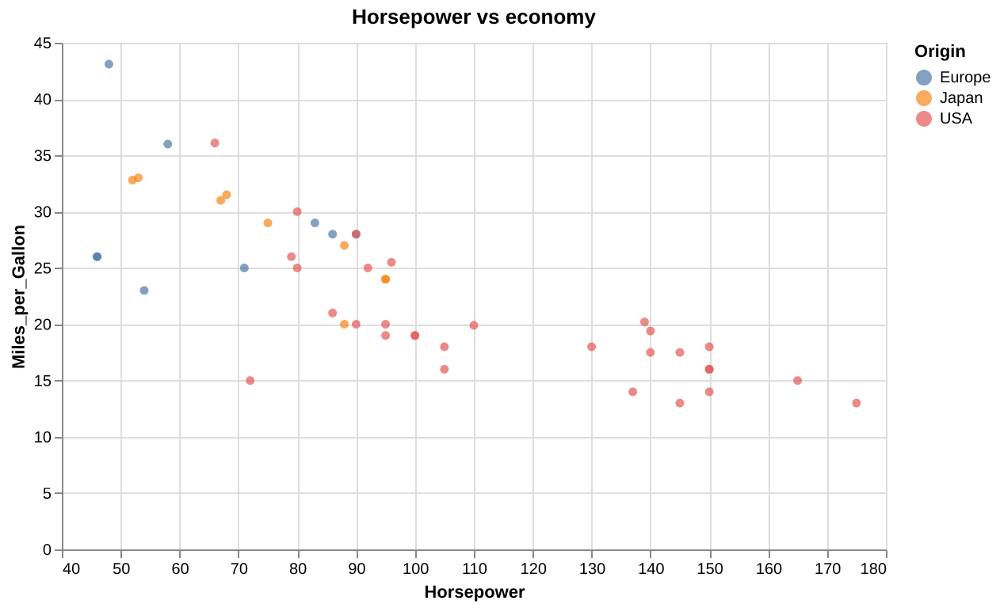

```nim
chart(cars, title="Horsepower vs economy")
  .markPoint(filled=true)
  .encode(
    x=X("Horsepower:Q", scale=Scale(zero=false)),
    y="Miles_per_Gallon:Q",
    color="Origin:N"
  )
  .tooltips("Name:N", "Horsepower:Q")
```

**Bar chart, sorted by its own values**

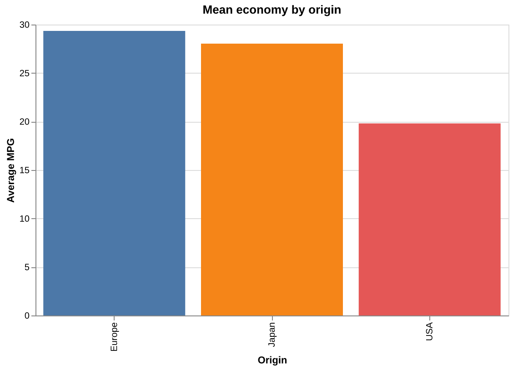

```nim
chart(cars, title="Mean economy by origin")
  .markBar()
  .encode(
    x=X("Origin:N", sort="-y"),
    y=Y("mean(Miles_per_Gallon):Q", title="Average MPG"),
    color=Color("Origin:N", legend=noLegend())
  )
```

**Histogram** — bin one column, count what lands in each bucket

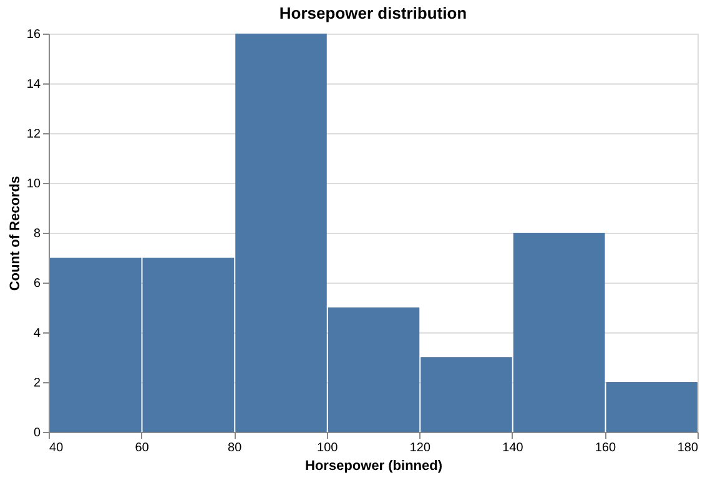

```nim
chart(cars, title="Horsepower distribution")
  .markBar()
  .encode(
    x=X("Horsepower:Q", bin=Bin(maxbins=8)),
    y="count()"
  )
```

There is also a one-liner for this: `hist(values, maxbins=8)`.

**Layered line and points** — the same base, two marks

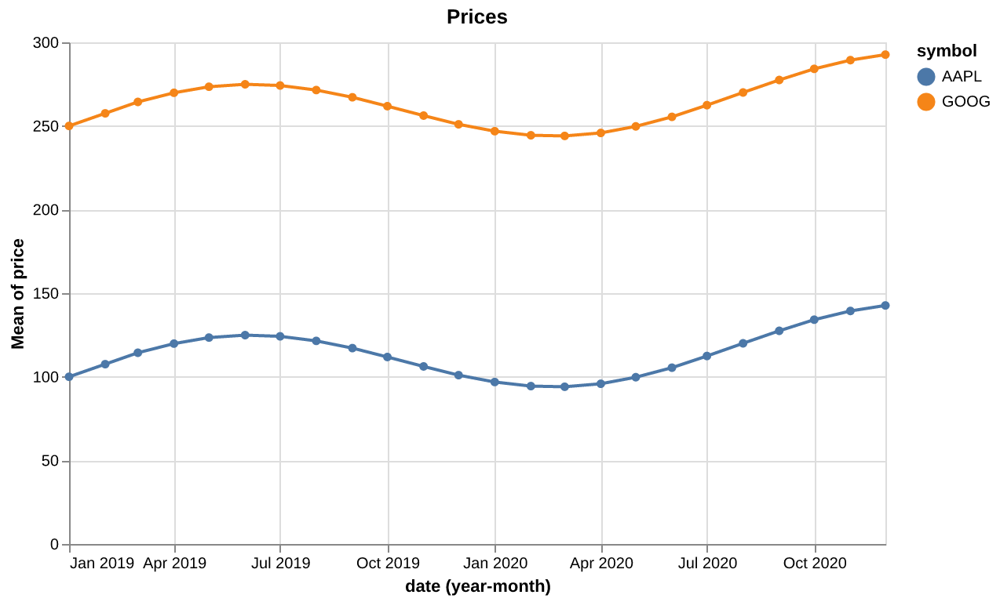

```nim
let base = chart(stocks)
  .encode(x="yearmonth(date):T", y="mean(price):Q", color="symbol:N")

base.markLine() + base.markPoint(size=30, filled=true)
```

**Small multiples**

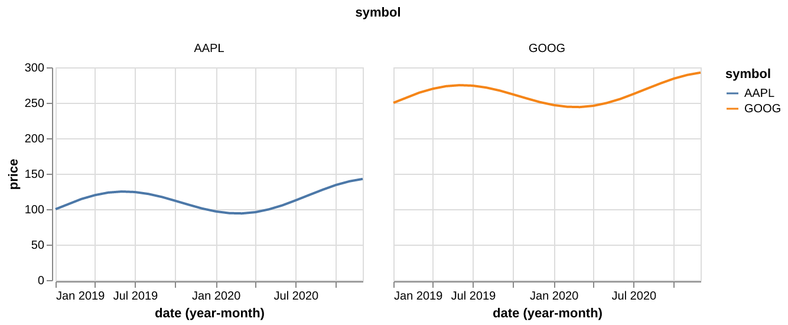

```nim
chart(stocks)
  .markLine()
  .encode(x="yearmonth(date):T", y="price:Q", color="symbol:N")
  .properties(width=260, height=180)
  .facet(column="symbol:N")
```

**Normalized stacked bar** — share rather than count

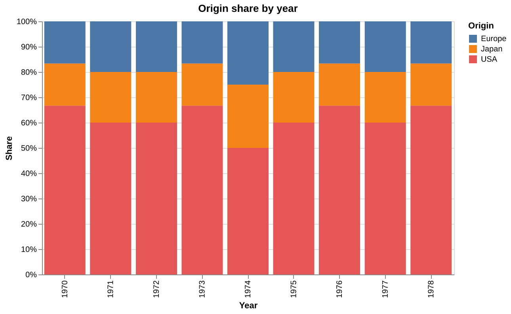

```nim
chart(cars, title="Origin share by year")
  .markBar()
  .encode(
    x="Year:O",
    y=Y("count():Q", stack="normalize", title="Share"),
    color="Origin:N"
  )
```

**Scatter with a fitted trend line** — a transform on one layer only

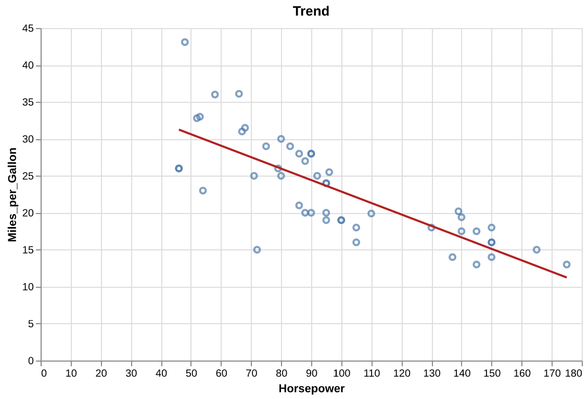

```nim
let base = chart(cars, title="Trend")
  .encode(x="Horsepower:Q", y="Miles_per_Gallon:Q")

base.markPoint() +
  base.transformRegression("Miles_per_Gallon", "Horsepower")
      .markLine(color="firebrick")
```

**Heatmap**

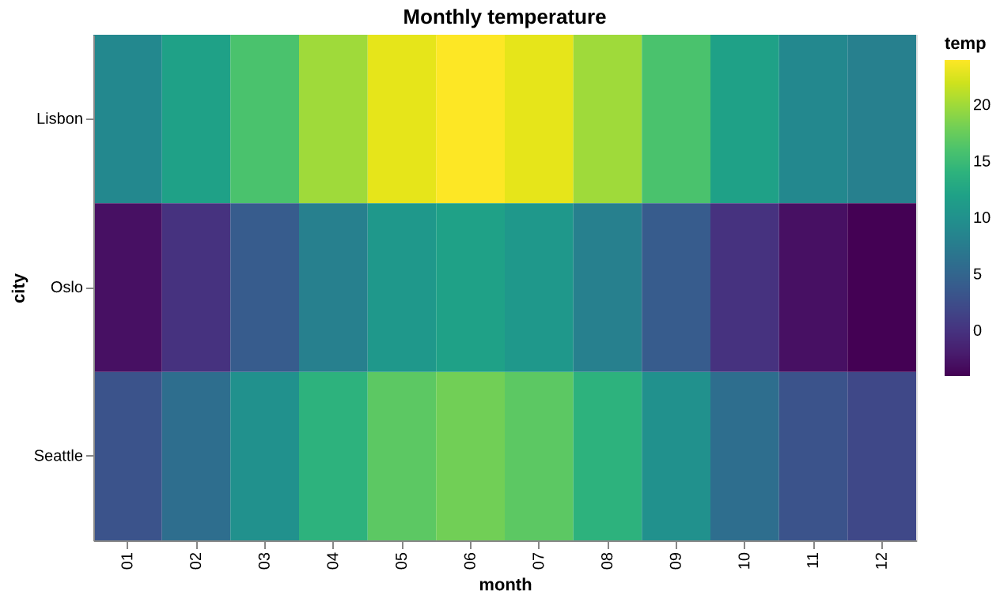

```nim
chart(weather, title="Monthly temperature")
  .markRect()
  .encode(
    x="month:O",
    y="city:N",
    color=Color("temp:Q", scale=Scale(scheme="viridis"))
  )
```

**Filtered and derived**

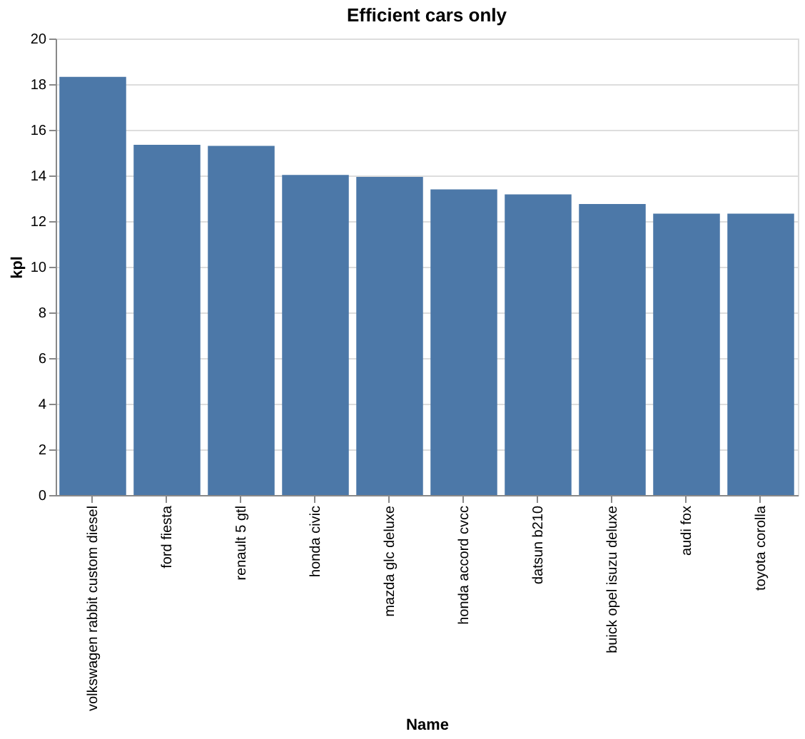

```nim
chart(cars, title="Efficient cars only")
  .transformFilter(expr(datum.Miles_per_Gallon > 28))
  .transformCalculate("kpl", "datum.Miles_per_Gallon * 0.425")
  .markBar()
  .encode(x=X("Name:N", sort="-y"), y="kpl:Q")
```

## Getting data in

```nim
type Penguin = object
  species: string
  billLength, flipperLength: float

let df = toDataFrame(penguins)          # one column per field
let df = readCsv("penguins.csv")        # types sniffed per column
let df = toDataFrame(table)             # Table[string, seq[T]]
let c  = chart("https://…/cars.json")   # fetched by the renderer, not inlined
```

## Encodings

Channel arguments take a shorthand string or a constructor — they are the same
`Encoding` type, so the two mix freely:

```nim
.encode(
  x="yearmonth(date):T",              # time unit
  y="mean(price):Q",                  # aggregate
  color=Color("symbol:N", legend=noLegend()),
  size=value(60))                     # a literal, not a column
```

`Q`/`N`/`O`/`T` are the field types; leave the suffix off and it is inferred from
the data. Multi-field channels have their own builders, since Nim cannot convert
inside a list literal: `.tooltips("Name:N", "Origin:Q")`.

Anything beyond the shorthand can be chained instead of nested, as in Altair 5 —
`scale`, `axis`, `legend`, `title`, `noTitle`, `bin`, `sort` and `stack` all take
an encoding and return a modified copy. The string converter reaches through a
dot call, so the bare shorthand is the head of the chain and no `X(...)` wrapper
is needed:

```nim
.encode(x="Horsepower:Q".scale(zero=false).axis(grid=false, labelAngle= -45),
        y="Miles_per_Gallon:Q",
        color="Origin:N".legend(orient="bottom"))
```

Both spellings mean the same thing and mix freely; repeated calls to one setter
merge, so `.scale(zero=false).scale(scheme="viridis")` keeps both keys. Use
`.axis(hidden=true)` / `.legend(hidden=true)` for the chained form of
`axis=noAxis()`.

Because every builder takes what it modifies first, the receiver-first spelling
works throughout — including on the way in and out:

```nim
df.chart(title="Cars").markPoint()      # chart(data: DataFrame)
people.toDataFrame().chart()            # the object/tuple adapter
"cars.csv".readCsv().chart().markBar()  # read, frame and chart in one line
base.layer(rule, labels)                # varargs builders take a receiver
c.saveJson("spec.json")                 # and the render side
```

## Composition

Altair's operators, and named equivalents for anyone who finds `&` cryptic:

```nim
base.markLine() + base.markPoint()      # layer,   or layer(a, b)
chartA | chartB                         # hconcat, or hconcat(a, b)
chartA & chartB                         # vconcat, or vconcat(a, b)

c.facet(column="symbol:N")
c.repeat(column=@["a", "b"])            # reference fields with Rep("column")
```

Shared data is hoisted to the enclosing spec, so layering three marks over one
frame inlines the rows once rather than three times.

## Transforms

```nim
c.transformFilter(expr(datum.price > 100 and datum.origin == "USA"))
 .transformCalculate("kpl", "datum.mpg * 0.425")
 .transformAggregate(@[agg(agMean, "price", "avg")], groupby=@["symbol"])
 .transformWindow(@[win("rank", to="rank")], sort=@[sortField("price")])
```

`expr(...)` translates Nim syntax into a Vega expression at compile time, so a
mistyped operator is a compile error. `transformFilter` also takes a plain
string.

## Themes

`enableTheme` sets defaults for every chart emitted afterwards — process-wide
state, as in Altair — and `registerTheme` adds your own:

```nim
enableTheme("dark")                     # or "clean"
registerTheme("mine", Config(isSet: true, font: "Inter"))
```

A chart's own config wins over the theme's, field by field. Here the chart sets
nothing but `labelAngle`, so the rest of the dark theme's axis styling survives:

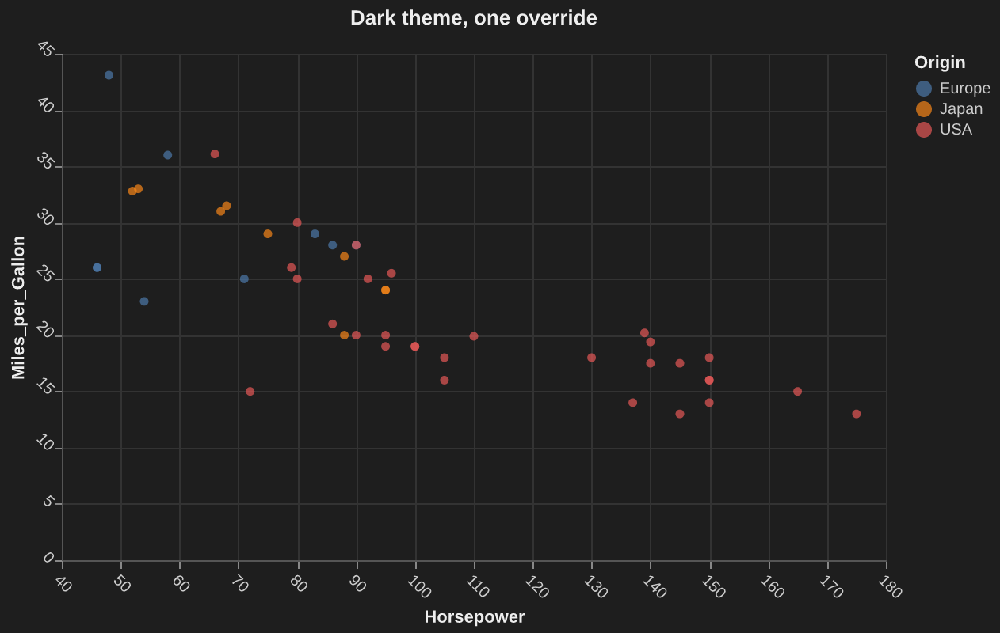

```nim
enableTheme("dark")

chart(cars, title="Dark theme, one override")
  .markPoint(filled=true)
  .encode(
    x=X("Horsepower:Q", scale=Scale(zero=false)),
    y="Miles_per_Gallon:Q",
    color="Origin:N"
  )
  .configureAxis(labelAngle=45)
```

With no theme enabled, the same `.configure*` calls are simply per-chart
styling:

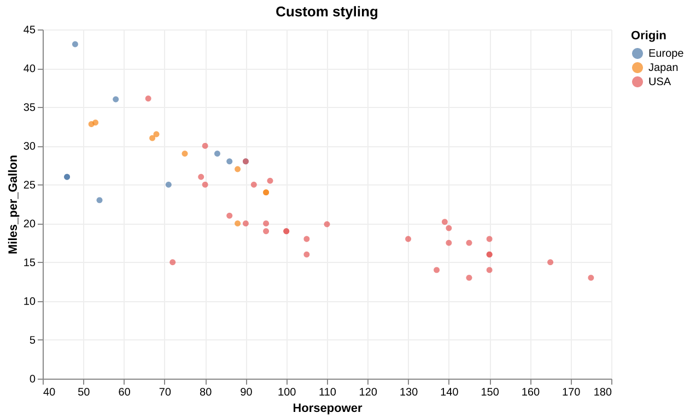

```nim
chart(cars, title="Custom styling")
  .markPoint(filled=true)
  .encode(
    x=X("Horsepower:Q", scale=Scale(zero=false)),
    y="Miles_per_Gallon:Q",
    color="Origin:N"
  )
  .configureView(noStroke=true)
  .configureAxis(gridColor="#eeeeee")
```

## When something isn't modelled

Vega-Lite's schema is large and this library types a curated subset. Every node
takes a `raw: JsonNode` that is deep-merged over the generated one, so a missing
field never blocks anything:

```nim
.encode(x=X("a:Q", raw=%*{"impute": {"value": 0}}))
```

## Commands

```sh
nimble test        # the full suite
nimble examples    # render examples/gallery.nim to examples/out/
nimble docimages   # re-render the images in this README
```

`examples` and `docimages` need `vl-convert` on PATH. The quickest way to get
it is a prebuilt binary — no Rust toolchain needed:

```sh
curl -LO https://github.com/vega/vl-convert/releases/latest/download/vl-convert_linux-64.zip
unzip vl-convert_linux-64.zip && install bin/vl-convert ~/.local/bin/
```

(swap `linux-64` for `osx-arm64`, `osx-64`, `linux-aarch64` or `win-64`.)
`cargo install vl-convert --locked` also works if you would rather build it.
